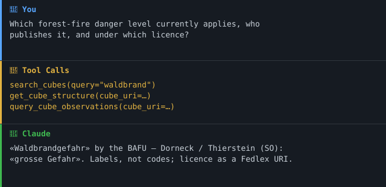

> **Teil des [Swiss Public Data MCP Portfolios](https://github.com/malkreide/swiss-public-data-mcp)** — einer Sammlung quelloffener MCP-Server, die KI-Agenten mit Schweizer öffentlichen und offenen Daten verbinden.
> Dies ist ein privates Projekt. Es steht in keiner Verbindung zu einem Arbeitgeber oder einer Behörde und wird nicht in deren Auftrag betrieben.

# lindas-mcp

[](LICENSE)
[](https://www.python.org/)
[](https://modelcontextprotocol.io/)
[](https://lindas.admin.ch)

**MCP-Server für LINDAS — den Linked-Data-Wissensgraph der Schweizer Bundesverwaltung.**

🇬🇧 [English version](README.md)

---

## Was LINDAS ist

LINDAS (Linked Data Service) ist der SPARQL-Wissensgraph des Bundes, betrieben
vom Schweizerischen Bundesarchiv. Statt Tabellen publiziert er Daten als
RDF-Tripel: rund 2000 statistische **Data Cubes** (cube.link) von Bundesämtern,
plus die Geo-Linked-Data, die visualize.admin.ch speist.

> **Eselsbrücke: «I14Y ist der Bibliothekskatalog, LINDAS ist die Bibliothek
> selbst.»** [i14y-mcp](https://github.com/malkreide/i14y-mcp) sagt dir, *dass*
> ein Datensatz existiert. LINDAS enthält die Daten und lässt dich quer durch
> alle gleichzeitig fragen.

Dieser Server kapselt LINDAS in Tools mit Leitplanken statt in rohes SPARQL,
weil der Store präzise Abfragen belohnt und bei breiten ins Timeout läuft.

---

## 🎯 Anchor Demo Query

> *«Welche Waldbrand-Gefahrenstufe gilt aktuell, wer publiziert das, und unter
> welcher Lizenz?»*

```
search_cubes(query="waldbrand")
  → «Waldbrandgefahr» — BAFU, published

get_cube_structure(cube_uri=...)
  → Dimensionen: Warnregion (Key), Gefahrenstufe (Measure)
  → Lizenz: fedlex.data.admin.ch/eli/cc/1984/... (eine Fedlex-URI!)

query_cube_observations(cube_uri=...)
  → Warnregion: «Dorneck / Thierstein (SO)», Gefahrenstufe: «grosse Gefahr»
```

Die Codes kommen als Labels zurück — «grosse Gefahr», nicht `4`. Und die Lizenz
ist eine Fedlex-URI, die du mit [fedlex-mcp](https://github.com/malkreide/fedlex-mcp) auflösen kannst.

### Demo



---

## Der Zwei-Phasen-Zugriff

LINDAS-Cubes sind selbstbeschreibend, aber codiert. Sie gut zu lesen heisst zwei
Schritte, die dieser Server erzwingt:

1. **Struktur zuerst** — `get_cube_structure` liest die SHACL-Shape des Cubes:
   Dimensionen (filterbare Achsen), Measures (die Zahlen) und welche Dimensionen
   Codelisten tragen.
2. **Daten danach** — `query_cube_observations` liest die Observations und löst
   codierte Werte mit der Struktur aus Schritt 1 zu Labels auf.

> **Eselsbrücke: «LINDAS spricht in Postleitzahlen, nicht in Ortsnamen.»** Eine
> Observation sagt Region `1805`; der Server macht daraus «Alpennordhang».

---

## Architektur

```
                 ┌──────────────────────────────┐
                 │      MCP Host (Claude)       │
                 └───────────────┬──────────────┘
                                 │ stdio | streamable-http
                 ┌───────────────▼──────────────┐
                 │          lindas-mcp          │
                 │  ┌────────────────────────┐  │
                 │  │ server.py  (7 Tools)   │  │  spricht nur mit cube.py
                 │  ├────────────────────────┤  │
                 │  │ lindas/cube.py         │  │  ← Vokabular-Guardrail,
                 │  │                        │  │    Zwei-Phasen-Zugriff,
                 │  │                        │  │    Code→Label-Aufloesung
                 │  ├────────────────────────┤  │
                 │  │ lindas/queries.py      │  │  SPARQL-Templates,
                 │  │                        │  │    alle auf Klasse verankert
                 │  ├────────────────────────┤  │
                 │  │ lindas/client.py       │  │  rohes SPARQL ueber HTTP,
                 │  │                        │  │    kennt keine Cubes
                 │  └────────────────────────┘  │
                 └───────────────┬──────────────┘
                                 │ HTTPS, ohne Auth
                 ┌───────────────▼──────────────┐
                 │  lindas.admin.ch/query       │
                 │  SPARQL 1.1 · ~2000 Cubes    │
                 └──────────────────────────────┘
```

Das `lindas/`-Paket ist bewusst geschichtet, damit es unverändert in andere
LINDAS-Server gehoben werden kann. `client.py` kennt nur HTTP und SPARQL,
`cube.py` kennt das cube.link-Vokabular, die Tools kennen nur `cube.py`. Rohes
SPARQL erreicht den Agenten nie ausser über den bewachten `run_sparql`-Escape.

### Architektur-Entscheid

**Architektur A (nur Live-SPARQL), mit striktem Vokabular-Guardrail.**

Live verifiziert am 21. Juli 2026:
- Endpunkt stabil, ohne Auth, sauberes HTTP 400 mit Diagnose bei Syntaxfehlern.
- Blinde Scans (`SELECT *`, `COUNT(*)` über den ganzen Store) laufen in 60–90 s
  ins Timeout; dieselbe Frage auf `?x a cube:Cube` verankert antwortet in ~2 s.

Konsequenzen, in die Tools eingebaut:
- Jedes Query-Template ist auf eine bekannte Klasse verankert. Keine Scans.
- Zwei-Phasen-Zugriff erzwungen; der Agent sieht nie rohe Codes.
- `run_sparql` bei 500 Zeilen und 30 s gedeckelt, als «Advanced» markiert.
- Client-Timeout bei 45 s, vor dem 60–90-s-Abbruch des Stores.

Vollständiger Probe-Report: [`docs/probe-lindas.md`](docs/probe-lindas.md).

---

## Tools

| Tool | Zweck |
|---|---|
| `search_cubes` | Cubes nach Thema finden. Einstieg. Dedupliziert Versionen. |
| `get_cube_structure` | Phase 1: Dimensionen, Measures, Lizenz. |
| `query_cube_observations` | Phase 2: Datenpunkte mit Codes als Labels. |
| `list_publishers` | Publizierende Bundesämter, mit Anzahl. |
| `resolve_municipality` | Name ↔ URI ↔ BFS-Nummer — der Join-Key. |
| `run_sparql` | Escape-Hatch für Fortgeschrittene. Gedeckelt, bewacht. |
| `api_status` | Erreichbarkeitsprüfung mit Cube-Anzahl. |

Alle Tools sind mit `readOnlyHint: true` annotiert.

---

## Installation

```bash
uvx lindas-mcp
```

### Claude Desktop

```json
{
  "mcpServers": {
    "lindas": {
      "command": "uvx",
      "args": ["lindas-mcp"]
    }
  }
}
```

### Remote-Betrieb

```bash
LINDAS_MCP_TRANSPORT=sse PORT=8000 lindas-mcp
```

`LINDAS_MCP_TRANSPORT` akzeptiert `stdio` (Standard), `sse` oder `streamable-http`.
Der SSE-/streamable-http-Transport bindet an `HOST`, **Default `127.0.0.1`**;
mit `HOST=0.0.0.0` explizit exponieren (nur hinter einem Reverse-Proxy). Für ein
gehostetes HTTP-Deployment `ALLOWED_ORIGINS` auf eine kommagetrennte Liste von
Browser-Origins setzen (Default `*`) und `LOG_LEVEL` für die JSON-stderr-Logs.

### Docker

```bash
docker compose up --build          # bindet 0.0.0.0 im Container, published :8000
```

Das Image läuft als Nicht-Root-User, read-only, mit Ressourcen-Limits und einem
TCP-Health-Check (siehe [`Dockerfile`](Dockerfile) und [`compose.yaml`](compose.yaml)).

---

## Join Keys

LINDAS ist eine Verbindungsschicht, und zwei Identifikatoren machen sie mit dem
übrigen Portfolio kombinierbar:

| Schlüssel | Wo | Verbindet zu |
|---|---|---|
| BFS-Gemeindenummer | `resolve_municipality` → `bfs_number` | swiss-statistics-mcp, zurich-opendata-mcp |
| Fedlex-URI | Cube-Feld `licence` | [fedlex-mcp](https://github.com/malkreide/fedlex-mcp) |

Der Fedlex-Link ist die stille Überraschung: Viele Cubes deklarieren ihre Lizenz
als Rechtsgrundlagen-URI (`fedlex.data.admin.ch/eli/cc/...`), sodass du von einem
Datenpunkt direkt zum Gesetz gelangst, das ihn regelt.

---

## Bekannte Einschränkungen

Live verifiziert am 21. Juli 2026.

1. **Breites SPARQL läuft ins Timeout.** Der Store bricht unverankerte Scans bei
   60–90 s ab. Die bewachten Tools vermeiden das; `run_sparql` warnt davor und
   deckelt die Laufzeit.
2. **Observations sind codiert.** Dimensionswerte sind URIs, keine Labels. Der
   Server löst sie über die Codeliste jeder Dimension auf, was pro codierter
   Dimension eine Zusatzabfrage kostet. `resolve_labels=False` überspringt das.
3. **Kein serverseitiges Filtern von Observations nach beliebigem Wert.** LINDAS
   bietet keinen günstigen Weg, Observations innerhalb eines Cubes nach einem
   Dimensionswert zu filtern; `query_cube_observations` liest die ersten N.
   Analytisches Slicing gehört in `run_sparql`.
4. **Lizenzen variieren pro Cube** und stehen als `dcterms:license`, oft als
   Fedlex-URI statt als Klartext. Das `licence`-Feld immer ausweisen.
5. **Versionsbehandlung ist heuristisch.** `search_cubes` dedupliziert, indem es
   das Versionssuffix aus der Cube-URI entfernt und die höchste `schema:version`
   unter den publizierten Cubes behält. Ungewöhnliche URI-Formen kollabieren
   evtl. nicht sauber; mit `latest_only=False` alle Versionen prüfen.

---

## Tests

```bash
PYTHONPATH=src pytest tests/ -m "not live"   # offline, in der CI verwendet
PYTHONPATH=src pytest tests/ -m "live"       # gegen den echten Endpunkt
python -m ruff check src tests
```

Die Live-Tests verdienen ihren Platz: Die `observationSet`-Indirektion (die
Observations eines Cubes hängen an `cube:observationSet`, nie direkt am Cube)
ist eine Strukturannahme, die ein Mock nicht prüfen kann. Sie ist durch einen
Live-Test abgedeckt.

---

## Mitwirken

Siehe [`CONTRIBUTING.de.md`](CONTRIBUTING.de.md) für die Grundregeln (read-only,
ein Egress-Host, verankerte Queries) und die lokale Dev-Schleife. Weiterführend:
[`EXAMPLES.md`](EXAMPLES.md) für Anwendungsfälle nach Zielgruppe mit der
Tool-Auswahl-Tabelle, [`docs/roadmap.md`](docs/roadmap.md) für die Projektphase
und [`PUBLISHING.md`](PUBLISHING.md) für den PyPI-/MCP-Registry-Release-Prozess.

---

## Sicherheit

Siehe [`SECURITY.de.md`](SECURITY.de.md) für die Sicherheits-Posture und die
Meldung von Schwachstellen.

---

## Lizenz

MIT-Lizenz — siehe [LICENSE](LICENSE). Die LINDAS-Daten unterliegen weiterhin
der Lizenz, die der jeweilige Publisher am Cube deklariert.

---

## Autor

**Hayal Oezkan** · [github.com/malkreide](https://github.com/malkreide)

---

## Credits & verwandte Projekte

- Daten: [LINDAS Linked Data Service](https://lindas.admin.ch), Schweizerisches Bundesarchiv
- Vokabular: [cube.link](https://cube.link)
- Visualisierungs-Frontend auf denselben Cubes: [visualize.admin.ch](https://visualize.admin.ch)
- Quellenrecherche inspiriert von [rnckp/awesome-ogd-switzerland](https://github.com/rnckp/awesome-ogd-switzerland)
- Portfolio: [swiss-public-data-mcp](https://github.com/malkreide/swiss-public-data-mcp)

Lizenz: MIT. Die Cube-Daten unterliegen weiterhin der Lizenz, die jede
publizierende Stelle deklariert.

---

## MCP Registry

Ownership-Marker, mit dem die [MCP Registry](https://registry.modelcontextprotocol.io)
dieses PyPI-Paket mit dem GitHub-Namespace verknüpft:

```
mcp-name: io.github.malkreide/lindas-mcp
```

---

## MCP-Protokoll-Version

Die ausgehandelte MCP-Protokoll-Version wird vom gepinnten `mcp`-SDK verwaltet
(`mcp>=1.28.1` in `pyproject.toml`), das Dependabot aktuell hält. SDK-Upgrades
sind damit eine reviewte Änderung: Jeder protokollrelevante Bump wird in
`CHANGELOG.md` vermerkt, und der Tool-Vertrag ist zusätzlich durch
`tool-definitions.lock.json` (SEC-022) abgesichert, sodass eine Änderung der
Tool-Oberfläche die CI bis zum Review fehlschlagen lässt.
